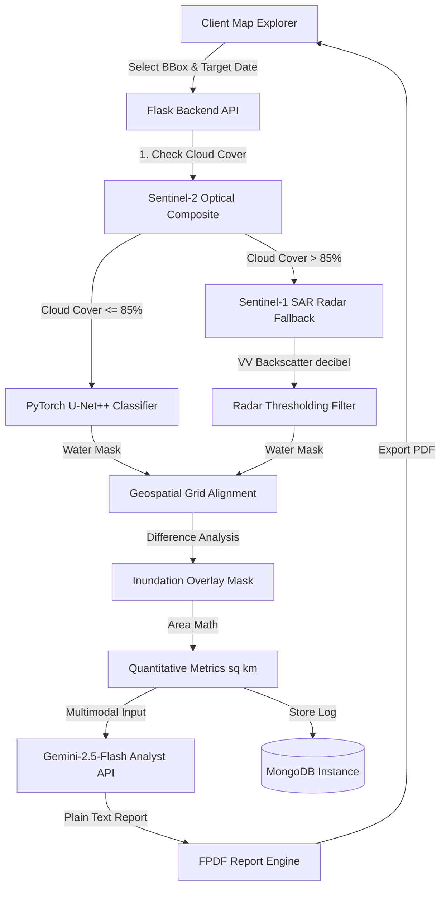

# SatVision: Multimodal Disaster GEOINT & Deep Learning Flood Assessment Platform

[](https://huggingface.co/spaces/SatVision/App)
[](https://huggingface.co/spaces/SatVision/App)
[](https://www.python.org/)
[](https://pytorchlightning.ai/)
[](https://opensource.org/licenses/MIT)

SatVision is an enterprise-grade, containerized Geospatial Intelligence (GEOINT) platform designed for **rapid post-flood disaster assessment**. It integrates multi-spectral satellite imagery, Synthetic Aperture Radar (SAR) sensors, and deep learning segmentation (U-Net++) with LLM-guided damage reporting to identify, quantify, and document disaster impacts in real-time.

---

## 💼 Business Case & Quantified Impact

### The Problem: Post-Disaster Action Delay
During extreme weather events, humanitarian agencies, insurance firms, and trust safety operations face a **geospatial visibility gap**:
1. **Severe Cloud Cover**: Standard optical satellite sensors (like Sentinel-2) are blind during active storms due to dense cloud ceilings, delaying mapping by weeks.
2. **Analysis Bottlenecks**: Manually segmenting flooding from multi-spectral bands across thousands of square kilometers is too slow for active search-and-rescue.
3. **Lack of Actionable Reports**: raw TIFF imagery is useless to ground teams; they require executive summaries translating pixel telemetry into affected infrastructure coordinates.

### The Solution: Automated Disaster Intelligence
SatVision automates the entire GEOINT pipeline, returning actionable alerts **within 90 seconds** of bounding box selection:
* **Multi-Modal Resilience**: When cloud cover exceeds 85%, the system automatically fails over to Sentinel-1 Radar (SAR) backscatter sensors, mapping water through cloud decks and darkness.
* **Executive DaLA Reports**: Dynamically feeds flood masks and local demographics directly into Gemini AI to compile professional Flood Damage and Loss Assessment (DaLA) reports.
* **Insulated Concurrency**: Session-isolated workspaces guarantee that concurrent emergency response requests run without memory leaks or file naming conflicts.

---

## 🗺️ System Architecture & Workflow

The platform coordinates cloud database queries, PyTorch neural networks, and LLM text generation:



---

## ⚙️ Key Technical Strengths

### 1. Multi-Modal Satellite Payload Fallback (Optical ⇆ SAR)
* **Optical Node (Sentinel-2)**: Captures 6 spectral bands: Red, Green, Blue, Near-Infrared (NIR), Short-wave Infrared-1 (SWIR1), and SWIR2 (B2, B3, B4, B8, B11, B12).
* **Radar Node (Sentinel-1 SAR GRD)**: Falls back to Synthetic Aperture Radar using Vertical-Transmit / Vertical-Receive (VV) polarization backscatter decibels (`sar_db < -16`) when clouds block optical views.

### 2. Dynamic Area Resolution Scaling
Querying high-resolution 10-meter satellite tiles across vast states can lead to Google Earth Engine timeouts. SatVision dynamically adjusts its resolution scale:
* **Small Areas (<0.2°)**: 10-meter crisp resolution scale (e.g. cities, bridges).
* **Medium Areas (0.2° - 0.6°)**: 40-meter resolution scale (e.g. regional valleys).
* **Vast Areas (>0.6°)**: 90-meter optimized resolution scale (e.g. Lake Manchar / Dadu district) to prevent server timeouts.

### 3. Concurrency-Insulated Workspaces
Each detection query compiles files within a unique UUID subdirectory (e.g., `server_downloads/{session_id}/`). This guarantees that multi-user parallel queries run without race conditions, file corruption, or database document collisions.

---

## 🧠 Machine Learning Model Profile

The core classification network is a **U-Net++ encoder-decoder architecture** wrapped in PyTorch Lightning.

* **Backbone**: ResNet-34 (ImageNet pre-trained feature extractor, frozen encoder weights).
* **Input Layer**: Modified to support 6 multi-spectral channels (dimension `[Batch, 6, Height, Width]`).
* **Output Classes**: 2 classes (Class 0: Cloud/Land, Class 1: Surface Water).
* **Sliding-Window Inference**: Evaluates images in 256x256 sliding windows with 50% overlap. Integrates a **2D Hanning window** blending mask to smooth boundary seams and eliminate grid-tiling artifacts.

---

## 📂 Repository Directory Structure

```text
SatVision/
├── backend/
│   ├── models/
│   │   └── SatVision_Model.ckpt      # U-Net++ PyTorch Lightning checkpoint (313MB)
│   ├── src/
│   │   ├── __init__.py
│   │   ├── app.py                     # Flask application factory
│   │   ├── config.py                  # Core variables & env validators
│   │   ├── database/                  # Connection managers (GEE, MongoDB)
│   │   ├── routes/                    # API Routing endpoints (SSE streaming)
│   │   └── services/                  # Business logic (model, cv2, gemini, GEE)
│   ├── main.py                        # Backend launcher script
│   ├── requirements.txt               # Backend Python pins
│   └── Dockerfile                     # Non-root user space container
│
├── frontend/
│   ├── public/                        # Leaflet markers & HTML shell
│   ├── src/
│   │   ├── components/                # Modular React layouts
│   │   │   ├── ControlPanel.jsx       # Bounding box & date selection
│   │   │   ├── ImageModal.jsx         # Zoomed satellite viewer
│   │   │   ├── MapExplorer.jsx        # Leaflet dynamic overlay layer
│   │   │   └── Sidebar.jsx            # History and download panel
│   │   ├── constants/                 # Preset coordinates constants
│   │   ├── utils/                     # Asset mapping helpers
│   │   ├── App.jsx                    # Core React component
│   │   └── index.js
│   ├── package.json                   # UI build configurations
│   └── .env.development               # Local URL definitions
│
├── .gitignore
├── .gitattributes                     # Git LFS tracking rules
└── README.md                          # Landing documentation (this file)
```

---

## 🚀 Installation & Local Replication

### 1. Prerequisites
Ensure you have the following installed:
* Python 3.10+
* Node.js v16+
* A valid Google Earth Engine service account (stored as JSON)
* A Google Gemini API key

### 2. Backend Setup
1. Navigate to the backend directory:
   ```bash
   cd backend
   ```
2. Create and activate a virtual environment:
   ```bash
   python -m venv .venv
   # Windows:
   .venv\Scripts\activate
   # macOS/Linux:
   source .venv/bin/activate
   ```
3. Install dependencies:
   ```bash
   pip install -r requirements.txt
   ```
4. Configure environment variables in `.env` (or shell variables):
   ```env
   EE_CREDENTIALS='{"type": "service_account", "project_id": "...", ...}'
   GEMINI_API_KEY="your-gemini-api-key"
   MONGO_URI="mongodb://localhost:27017/"
   ```
5. Launch the Flask API:
   ```bash
   python main.py
   ```
   The backend API will run on `http://localhost:5000`.

### 3. Frontend Setup
1. Navigate to the frontend directory:
   ```bash
   cd ../frontend
   ```
2. Install npm dependencies:
   ```bash
   npm install
   ```
3. Configure the local backend endpoint in `frontend/.env.development`:
   ```env
   REACT_APP_BACKEND_URL="http://localhost:5000"
   ```
4. Start the development server:
   ```bash
   npm start
   ```
   The UI will open automatically at `http://localhost:3000`.

---

## 🛡️ License
Distributed under the MIT License. See `LICENSE` for more information.

---

### 🌟 Project Implementation Note
* Developed and refactored by **Amad Mateen**. 
* Intended for emergency disaster response operations and portfolio demonstration.
